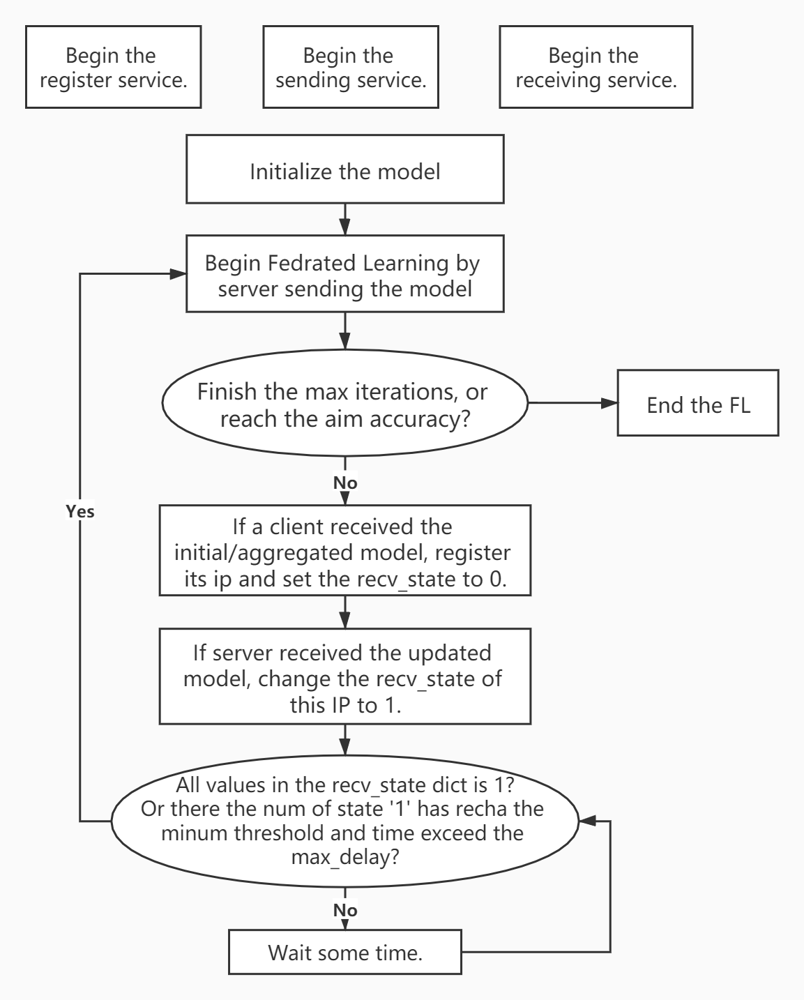

# COVID-19 Diagnosis With Federated Learning

<a rel="license" href="http://creativecommons.org/licenses/by-nc/3.0/"></a>
This work is licensed under a <a rel="license" href="http://creativecommons.org/licenses/by-nc/3.0/">Creative Commons Attribution-NonCommercial 3.0 Unported License</a>.


## 1. Introduction

**We developed a Federated Learning (FL) Framework for international researchers to collaboratively train an AI diagnosis model on multiple data centers without sharing the training data.** 

Please follow this User Guide for effective deployments at hospitals and non-profit organizations.

Similar to most C/S (Client/Server) structures, this framework consists of two parts: Server and Client. To apply this framework in real scenarios, we need to setup one server and  at least one client and ensure the client can ping the server successfully if it try to join in the training group. Taking hospitals as example, a machine works in the cloud as the central server to operate encrypted parameters from clients, update the global model and deliver the updated global model to  those clients in the training group. Meanwhile, a hospital's machine works as the client which has enough computing power to train the model locally and return the trained model to server to contribute to the global model.

Once the scripts are executed, the hospitals will train their own models locally and transmit the encrypted model parameters to the server which merges all parameter packets collected from the clients to update the global model. Then the server deliver the newly merged model parameters to each client maintaining the FL process **(client not transmits packets to server timely will be deleted from FL process)**. This process will be last for enough rounds before the global model reaches the desired performance.

Besides the functionality described above, we equip our framework with additional features as following:

1. **Homomorphic encryption**: each client could encrypt the parameters of their local trained model  via the generated private key, and the server will just aggregate those encrypted parameters without the ability to encode them;

2. **Weighted aggregation**: each client contribute the local trained model with weight to the global model , and the weight depends on the size of dataset for training on client.


### 1.1 Communication settings

For the need of encryption and weighted aggregation, it is not sufficient if the server and client only communicate the model parameters between them.

We define the file content format for this framework as follows:

​	File transmitted from Client contains:

> ​	"encrypted model_state": encrypted model parameters by the Client's private key
>
> ​	"client_weight": this Client's weight in the FL aggregation process (size of dataset for training)

​	File transmitted from Server contains: 

> ​	"model_state_dict": updated global model parameters
>
> ​	"client_weight_sum": the sum of clients' weight in the current FL process
>
> ​	"client_num": the number of clients in the current FL process

And we prepare ` pack_params/unpack_params`  functions both in Server and Client Class to generate/parse the file we mentioned above.

If someone doesn't need the Encryption or Weighted Aggregation, the file format could be redefined.  All the files are stored in `.pth` format to transmit.

### 1.2 Server

**1.2.1**   `./server` folder contains two main scripts `server_main.py` and `fl_server.py`. In `fl_server.py` we define the `FL_Server`  class, and in `server_main.py` we provide an example using `FL_Server` class.

**1.2.2**   Before starting the FL process, we need to set the server's configurations in `./server/config/config.json`.

> ```json
> {
>     "ip": "0.0.0.0",
>     "send_port": 12341,
>     "recv_port": 12342,
>     "clients_path": "./config/clients.json",
>     "model_path": "./model/model.py",
>     "weight_path": "./model/merge_model/initial.pth",
>     "merge_model_dir": "./model/merge_model/",
>     "client_weight_dir": "./model/client_model/",
>     "buff_size": 1024,
>     "iteration": 5
> }
> ```

`ip`,  `recv_port`: socket configurations, and `recv_port` listens constantly for the packets from clients.

`client_path`: `.json` file path to `clients.json`, which contains clients informations (`username` and `password`) which are accessible to join in the training process.

`weight_path`: the model which will be deliver to the clients in the FL process, and it will change automatically as the training process progresses. However, you need to define the initial path when you set up the serevr to start working.

`merge_model_dir`: each updated global model will be saved here.

`client_model_dir`: trained local model (`.pth` file) contributed by clients will be saved here, and the dir will be cleared when the aggregation process is over.

`iterations`:  rounds of FL training process.

**1.2.3**  `./server/config/clients.json` stores the `username`  and `password`  of each client.  Clients need to register to the server via this information. If the information is wrong, the register request will be refused and won't be allowed to participate in the FL process.

There are some examples below:

```json
{
"Bob": "123456", 
"Alan": "123456", 
"John": "123456"
}
```

### 1.3 Client

**1.3.1**  `./client`  folder contains two main scripts: In `fl_client.py`,  we define the `FL_Client` class,  and in `client_main.py`,  we provide an example of how to run it.

**1.3.2**  We need to set the client's configurations in `./client/config/client1_config.json`.

> ```json
> {
>   "username": "Bob",
>   "password": "123456",
>   "ip": "127.0.0.1",
>   "work_port": 12346,
>   "server_ip": "127.0.0.1",
>   "server_port": 12342,
>   "buff_size": 1024,
>   "model_path": "./model/model.py",
>   "weight_path": "./model/initial.pth",
>   "models_dir": "./model",
>   "seed": 1434,
>   }
>   ```

`ip`: ip of client.

`work_port`: the free port in client to send packets to server and receive from server.

`server_ip` : ip of server.

`server_port`:   the port is opened by server to listen the sending request from client. same as the `recv_port` in server configuration.

`model_path`: the path to save the model architecture, which is also delivered by the central server.

 ` weight_path`: It record the start model in the current FL training process, and it will be set automatically as the training process progresses.

`model_dir`: the path to save the model weight trained locally.

`seed`: the seed is used to generate private key.

**1.3.3** Because the training process also takes place on the Client machine, you also need to set your own train hyperparameter. Our configurations are given in the following as an example of `train_config_client.json'`:

> ```json
> {
>   "train_data_dir": "path to save raw data for training",
>   "train_df_csv": "csv file for training, and 'name' columns save the image name, 'label' columns svae the real label in classification task ",
>   "use_cuda": true,
>   "train_batch_size": 4,
>   "num_workers": 12,
>   "lr": 0.015,
>   "momentum": 0.9,
>   "iteration":1 // num of epochs to train locally.
>   }
>   ```

## 2.  FL framework installation

### Install FL framework from Github

Developers could run this command `git clone https://github.com/HUST-EIC-AI-LAB/COVID-19-Federated-Learning.git` to deploy your own FL task.

#### Installation Dependencies

Some dependencies may need to be pre-installed, e.g. PyTorch and CUDA, before you can train on GPU. Run `pip install -r requirement.txt` to install the required dependencies

**Notice:**
In `requirement.txt`, we use `PyTorch` that matches `cuda == 9.2`.

If there are problems in using torch, it may be caused by version mismatch between torch and CUDA, please check your CUDA version by `cat /usr/local/cuda/version.txt` , and download the correct version of PyTorch from the official website.

**ATTENTION:**

`ninja`  and `re2c`  are C ++ extension methods,  you should install them as described in their github.

`ninja` : https://github.com/ninja-build/ninja

`re2c`   : https://github.com/skvadrik/re2c

Our encryption algorithm comes from https://github.com/lucifer2859/Paillier-LWE-based-PHE

**Docker:**

we have also provide docker option, which supports `PyTorch 1.6.0` with `cuda 10.1`, where it automatically install the python dependencis in`requirements.txt` , `apx`, `ninja` and `re2c`. It is located in the `docker` folder.

To set up:

```bash
cd docker
sh build_docker.sh
# after build finished
sh launch_docker.sh
```

## 3. Implementation of FL

**3.1**   We have reduced the operations required in the communication process as much as possible. Yet, the Client training process and the Server aggregating process still need to be customized by the researcher.

We provide a rough template for the communication process, `./server/server_main_raw.py`  and `./client/client_main_raw.py`. Therefore you can design your own federated learning process accordingly.

In addition, we also provide our federated learning code for COVID-19 prediction as an example, which contains encryption and weighted aggregation as well.

To set up, first run the `server_main_raw.py`  file, then run the `client_main_raw.py`  file on the client machine. You can add any number of clients, only need to modify the corresponding configuration in `client_config.json`  and `train_config_client.json`.

> ```python
> // in client_main_raw.py
> client = FL_Client('./config/client_config.json')
> client.start()
> with open('./config/train_config_client.json') as j:
> 	train_config = json.load(j)
>    ```

After modifying the corresponding configuration, run each client worker separately:

```bash
# launch the central server
cd server && python server_main.py
# start training model on client 1
cd client 
CUDA_VISIBLE_DEVICES=0,1 python client1_main.py
# start training another model on client 2
CUDA_VISIBLE_DEVICES=2,3 python client2_main.py
# more clients can be added
```

**3.2  Some tips**

Our FL process has more flexibility. For the server, developers can select all registered clients to do aggregation. Or you can also set a minimum number of clients `min_clients` and a `timeout` delay: when enough number of clients finish transmitting or the time for clients to upload is timeout (server starts timing when receiving the first packet from any client), the server can start the aggregation process in advance, and no longer receive requests from any client. Meanwhile, server will delete those client not upload timely from training group util they request to join in the training process again.

## 4. Others

Our communication process is based on Socket. If you want to successfully deploy this framework in the real scenario, developers may need to consider the port setting and firewall settings to ensure the network connection is successful.

The flow chart is as following:

